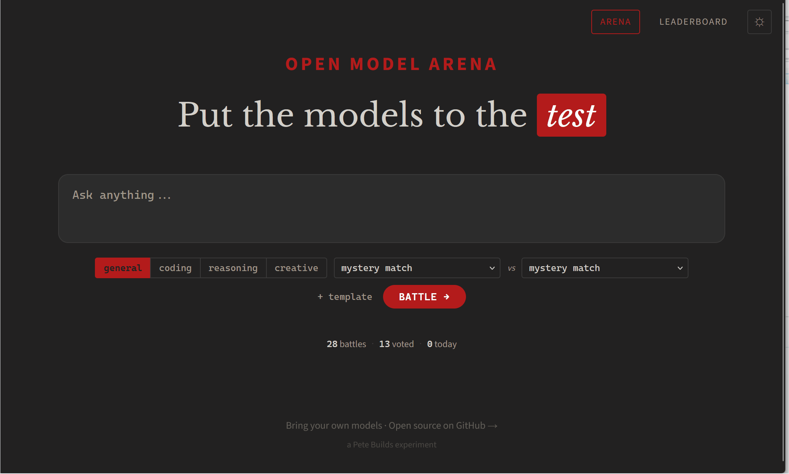

# Open Model Arena

> Compare local and cloud models in a self-hosted arena using blind voting and ELO rankings.

**Bring your own models. Run blind battles.**



If you're running your own AI stack -- Ollama on a Mac Mini, models on a GPU server, llama.cpp on bare metal, vLLM in a container -- you've probably wondered how your local models actually compare to the cloud APIs you're paying for. Open Model Arena gives you a way to find out.

Two models get the same prompt. You read both responses without knowing which model wrote which. You vote. ELO rankings track the results over time. That's it.

**What makes this different from public leaderboards:** those benchmarks test their models with their prompts on their hardware. They don't tell you how Mistral 7B running on your Mac Mini compares to GPT-4o for the prompts your team actually uses. Open Model Arena runs on your infrastructure, with your models, your prompts, and your data. A $0 local model and a $15/million-token cloud API get the same blind evaluation.

**How is this different from Chatbot Arena?** [Chatbot Arena](https://lmarena.ai/) (LMSYS) is a research platform that published its code. Running it yourself means installing FastChat, Gradio, and a full inference serving framework. It's designed to serve models, not connect to ones you already have. Open Model Arena is a self-hosted tool designed to be deployed. One Docker container, one YAML file, no inference framework required. If your models are already running on Ollama, behind an API, or through a gateway, you're five minutes from your first blind battle.

## Who is this for?

- **Homelab and self-hosted AI users** running Ollama, LM Studio, vLLM, or LocalAI who want to benchmark their local models against cloud APIs
- **Teams evaluating models** for internal use who need blind comparisons on their own prompts, not public benchmarks
- **Anyone with an OpenAI-compatible endpoint** -- cloud providers, local inference, API gateways, proxies, or a mix of all of them

## Features

**The core:**
- **Blind comparison** -- models are hidden until after you vote, so the response speaks for itself
- **Targeted comparison** -- skip the mystery match and pick two specific models to go head-to-head
- **Real-time streaming** -- both responses stream simultaneously via Server-Sent Events
- **ELO leaderboard** -- standard rating system (K=32), filterable by category, with provisional thresholds

**Everything else:**
- Category support (general, coding, reasoning, creative)
- Per-response cost tracking based on model pricing config
- Vote audit log with before/after ELO for every vote
- Markdown rendering with syntax highlighting
- Prompt templates saved to localStorage
- Battle export (CSV or JSON)
- Dark/light theme

## Quick Start

```bash
git clone https://github.com/pete-builds/open-model-arena.git
cd open-model-arena
cp models.yaml.example models.yaml
cp .env.example .env

# Edit models.yaml with your API endpoints and keys
# Edit .env with a passphrase and a random token secret:
#   ARENA_PASSPHRASE=your-secret-phrase
#   AUTH_TOKEN_SECRET=$(openssl rand -hex 32)

docker compose up -d
```

Open `http://localhost:3694`

**HTTPS note:** Auth cookies use `Secure=True`, which requires HTTPS. This works automatically on `localhost`. For remote access, use any HTTPS-capable reverse proxy (nginx, Caddy, Cloudflare Tunnel, Tailscale Funnel, etc.).

## Configuration

### models.yaml

Define your providers and models in YAML. See `models.yaml.example` for the full format.

```yaml
providers:
  my-gateway:
    base_url: "https://your-api-gateway.com/v1"
    api_key_env: "GATEWAY_API_KEY"  # reads from environment
    timeout: 30

  local-ollama:
    base_url: "http://localhost:11434/v1"
    api_key: "ollama"
    timeout: 120
    local: true                     # prevents pairing two local models

models:
  - id: gpt-4o
    provider: my-gateway
    display_name: "GPT-4o"
    model_id: "gpt-4o"
    input_cost_per_1m: 2.5
    output_cost_per_1m: 10.0
    categories: [general, coding, reasoning, creative]
    enabled: true
```

- `api_key_env` reads the key from an environment variable (recommended)
- `api_key` sets the key directly (for local services like Ollama)
- `categories` controls which battles a model can appear in
- Set `enabled: false` to temporarily remove a model
- Models are randomly paired; the system avoids pairing two local models together

### Environment Variables

| Variable | Required | Description |
|----------|----------|-------------|
| `ARENA_PASSPHRASE` | Yes | Passphrase users enter to access the arena |
| `AUTH_TOKEN_SECRET` | Yes | Secret key for signing auth tokens (`openssl rand -hex 32`) |
| `GATEWAY_API_KEY` | No | API key for your gateway provider |
| `TZ` | No | Timezone for "battles today" stat (default: `America/New_York`) |

The app will refuse to start without `ARENA_PASSPHRASE` and `AUTH_TOKEN_SECRET`.

## Tech Stack

- **Backend:** Python / FastAPI
- **AI Client:** OpenAI SDK (works with any OpenAI-compatible API)
- **Streaming:** Server-Sent Events (SSE)
- **Database:** SQLite with WAL mode
- **Frontend:** Vanilla JS + ES modules (no build step)
- **Container:** Docker

## API

| Method | Path | Description |
|--------|------|-------------|
| `POST` | `/api/battle` | Start a battle |
| `GET` | `/api/battle/{id}/stream` | SSE stream |
| `POST` | `/api/battle/{id}/vote` | Cast a vote |
| `GET` | `/api/leaderboard?category=overall` | ELO rankings |
| `GET` | `/api/models` | List enabled models |
| `GET` | `/api/export?format=csv` | Download battle history |
| `GET` | `/healthz` | Health check |

## Prior Art

Inspired by [Chatbot Arena](https://lmarena.ai/) (LMSYS), which pioneered blind model comparison at scale. Open Model Arena brings that concept to self-hosted infrastructure for teams and individuals who want to evaluate models privately.

## License

MIT
