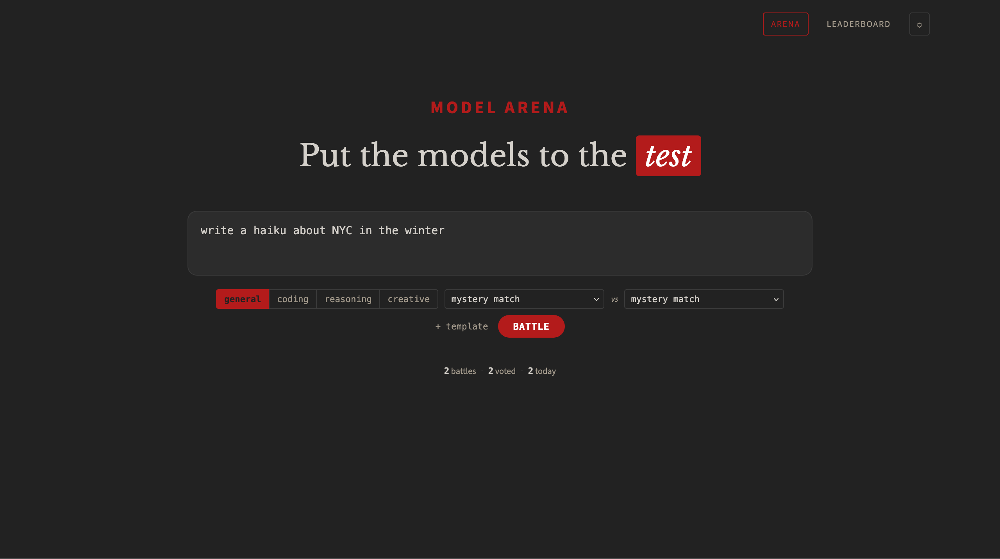

# Model Arena

A self-hosted tool for comparing AI models side-by-side. Two models respond to the same prompt simultaneously, and you vote on which response you prefer without knowing which model produced it. An ELO rating system tracks results over time.

Inspired by [Chatbot Arena](https://lmarena.ai/) (LMSYS), built for teams who want to run private evaluations on their own infrastructure.

## Screenshots



## Why Model Arena?

If you're working with multiple models, you're often asking questions like:

- Is this local model good enough, or should I call an API model instead?
- Which local model actually performs better for my prompts?
- Is a cheaper model close enough to replace a more expensive one?

Model Arena makes it easy to run blind comparisons across:

- **Local models** (Ollama, vLLM, LiteLLM gateways)
- **API models** (OpenAI, Anthropic, Gemini, etc.)
- **Local vs API models**
- **Different versions or quantizations of the same model**

Send the same prompt to two models, vote on the better response without seeing which model produced it, and track results over time with an ELO leaderboard.

## Features

- **Real-time streaming** — Both responses stream simultaneously via Server-Sent Events
- **ELO leaderboard** — Standard ELO rating system (K=32), filterable by category
- **Category support** — General, coding, reasoning, creative
- **Cost tracking** — Per-response cost estimates based on model pricing config
- **Vote audit log** — Full history with before/after ELO for every vote
- **Markdown rendering** — Responses rendered with syntax highlighting
- **Prompt templates** — Save and reuse prompts from localStorage
- **Battle export** — Download battle history as CSV or JSON

## How It Works

1. Enter a prompt and select a category
2. Two models are randomly selected (configurable rules prevent unfair pairings)
3. Both models receive the prompt and stream responses side-by-side
4. Vote: "A Wins", "Tie", or "B Wins"
5. Models are revealed with latency, token count, cost, and ELO change
6. Leaderboard tracks cumulative performance

## Quick Start

```bash
# Copy the example configs
cp models.yaml.example models.yaml
cp .env.example .env

# Edit models.yaml with your API endpoints and keys
# Edit .env with a passphrase and a random token secret:
#   ARENA_PASSPHRASE=your-secret-phrase
#   AUTH_TOKEN_SECRET=$(openssl rand -hex 32)

# Then start:
docker compose up -d
```

Open `http://localhost:3694`

### HTTPS Note

Auth cookies are set with `Secure=True`, which requires HTTPS. This works automatically on `localhost` (browsers treat it as secure). For remote access, put the app behind any HTTPS-capable reverse proxy (nginx, Caddy, Cloudflare Tunnel, Tailscale Funnel, etc.).

## Configuration

### Environment Variables

| Variable | Required | Description |
|----------|----------|-------------|
| `ARENA_PASSPHRASE` | Yes | Passphrase users enter to access the arena |
| `AUTH_TOKEN_SECRET` | Yes | Secret key for signing auth tokens (`openssl rand -hex 32`) |
| `GATEWAY_API_KEY` | No | API key for your gateway provider (referenced in `models.yaml` via `api_key_env`) |
| `TZ` | No | Timezone for "battles today" stat (default: `America/New_York`) |

See `.env.example` for a ready-to-copy template. The app will refuse to start without `ARENA_PASSPHRASE` and `AUTH_TOKEN_SECRET`.

### models.yaml

The model registry is a YAML file that defines providers and models. See `models.yaml.example` for the full format.

```yaml
providers:
  my-gateway:
    base_url: "https://your-api-gateway.com/v1"
    api_key_env: "GATEWAY_API_KEY"  # reads from environment
    timeout: 30

  local-ollama:
    base_url: "http://localhost:11434/v1"
    api_key: "ollama"
    timeout: 120
    local: true                     # prevents pairing two local models

models:
  - id: gpt-4o
    provider: my-gateway
    display_name: "GPT-4o"
    model_id: "gpt-4o"
    input_cost_per_1m: 2.5
    output_cost_per_1m: 10.0
    categories: [general, coding, reasoning, creative]
    enabled: true
```

**Key points:**
- `api_key_env` reads the key from an environment variable (recommended)
- `api_key` sets the key directly (for local services like Ollama)
- `model_id` is what gets sent in the API request
- `categories` controls which battles a model can appear in
- Set `enabled: false` to temporarily remove a model

### Model Selection Rules

- Models are randomly paired from the selected category
- The system avoids pairing two local (Ollama) models together
- Position (A vs B) is randomized to prevent position bias

## Tech Stack

- **Backend:** Python 3.12 / FastAPI
- **AI Client:** OpenAI SDK (works with any OpenAI-compatible API)
- **Streaming:** Server-Sent Events (SSE)
- **Database:** SQLite with WAL mode (aiosqlite)
- **Frontend:** Vanilla JS + highlight.js + marked.js (CDN)
- **Container:** Docker (python:3.12-slim)

## API

| Method | Path | Description |
|--------|------|-------------|
| `POST` | `/api/battle` | `{"prompt": "...", "category": "general"}` → `{"battle_id": "..."}` |
| `GET` | `/api/battle/{id}/stream` | SSE stream with events: `model_a`, `model_b`, `model_a_done`, `model_b_done`, `battle_complete` |
| `POST` | `/api/battle/{id}/vote` | `{"winner": "a\|b\|tie"}` → reveals models + ELO changes |
| `GET` | `/api/leaderboard?category=overall` | ELO rankings |
| `GET` | `/api/stats` | Battle counts |
| `GET` | `/api/models` | List enabled models |
| `GET` | `/api/export?format=csv` | Download battle history (csv or json) |

## ELO System

- Starting rating: 1500
- K-factor: 32
- Ratings tracked per-category and overall
- Ties award 0.5 score to each model

## License

MIT
